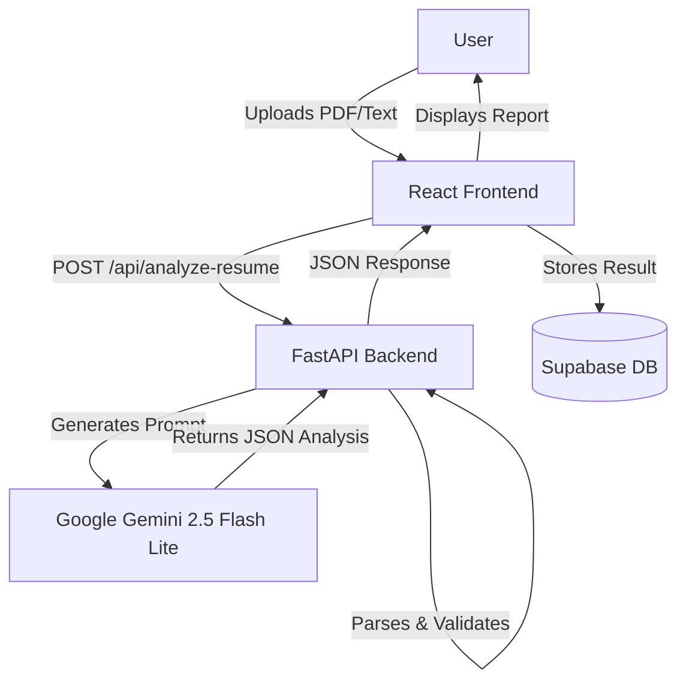
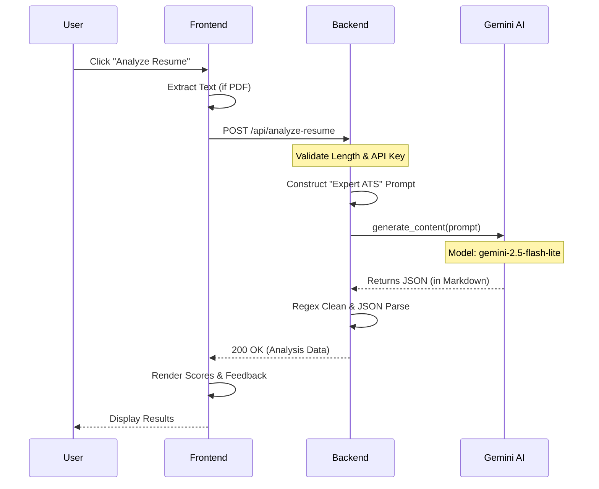

# Internal System Flow & Analysis Architecture

This document details the internal technical flow of the Resume Analyzer, specifically focusing on how resuems are processed, the prompt engineering strategies used, and the integration with Google Gemini 2.5.

## 🏗️ High-Level Architecture

The system follows a typical client-server architecture with an AI agent layer:

---

## 🔍 The Resume Analysis Lifecycle

The core value of the application is the **Resume Analysis Pipeline**. Here is the step-by-step internal flow:

### 1. Frontend Capture & Preparation
- **Input**: The user provides a resume (PDF or text) and optionally a Job Description (JD).
- **PDF Parsng**: If a PDF is uploaded, the frontend uses `pdf.js` (via a utility helper) to extract raw text client-side.
- **Validation**: Checks for minimum/maximum character limits before sending.
- **Mode Selection**:
    - **Normal Mode**: Runs a local TF-IDF (Term Frequency-Inverse Document Frequency) algorithm in the browser.
    - **AI Mode**: Sends the payload to the Backend API.

### 2. Backend Orchestration (`server.py`)
- **Endpoint**: `POST /api/analyze-resume`
- **Authentication**:
    - Checks for a `geminiApiKey` in the request (User's custom key).
    - Falls back to `EMERGENT_LLM_KEY` (Universal provided key) if no custom key is present.
- **Optimization Strategy**:
    - The code implements a **Single-Shot Optimization**. Instead of making 4-5 separate API calls (one for summary, one for skills, one for score, etc.), it constructs **one massive, structured prompt** to get all data in a single round-trip. This significantly reduces latency and cost.
    - **Model**: Explicitly uses `gemini-2.5-flash-lite` for the best balance of speed and free-tier quota limits.

### 3. Prompt Engineering (The "Brain")
The backend acts as a prompt engineer, wrapping the raw resume data into a specialized persona-based prompt.

**The System Prompt:**
> "You are an expert ATS analyst and career coach. Analyze this resume against the job description and provide comprehensive feedback."

**Prompt Structure:**
1.  **Context Injection**: Injects the `RESUME` and `JOB DESCRIPTION` text.
2.  **Scoring Rules**: precise definitions for calculating:
    *   **ATS Score**: Checks for contact info, formatting, action verbs, etc.
    *   **JD Match Score**: Checks for required skills, experience match, etc.
    *   **Structure Score**: Checks for white space, headings, and logical flow.
3.  **Extraction Instructions**: Requests candidate metadata (Name, Role, Years of Exp).
4.  **Actionable Feedback**: Requests "Quick Wins", "Critical Gaps", and section-by-section analysis.
5.  **Output Enforcement**: **CRITICAL**: The prompt explicitly creates a contract for the output format, demanding **ONLY valid JSON** matching a specific schema.

### 4. AI Processing & Response Parsing
- **Gemini Execution**: The `google-generativeai` SDK sends the prompt.
- **Response Handling**:
    - The AI returns a text block, often wrapped in Markdown code blocks (e.g., \`\`\`json ... \`\`\`).
    - **Robust Parsing (`parse_json_response`)**:
        - The backend uses Regular Expressions (`re`) to strip away Markdown formatting.
        - It extracts the raw JSON string.
        - It attempts to `json.loads()` the clean string.
        - **Error Handling**: If the AI returns malformed JSON, the backend catches the error and returns a 502 (Bad Gateway) or similar structure to alert the frontend.

### 5. Data Delivery & Persistence
- The Backend returns the clean Python dictionary as a JSON HTTP response.
- **Frontend**:
    - Receives the data.
    - **Database Write**: Immediately attempts to save the result to Supabase (`resume_analyses` table) for history tracking.
    - **Visualization**: Updates the UI State to render the score gauges, finding cards, and chat interface.

---

## 🧬 Sequence Diagram

